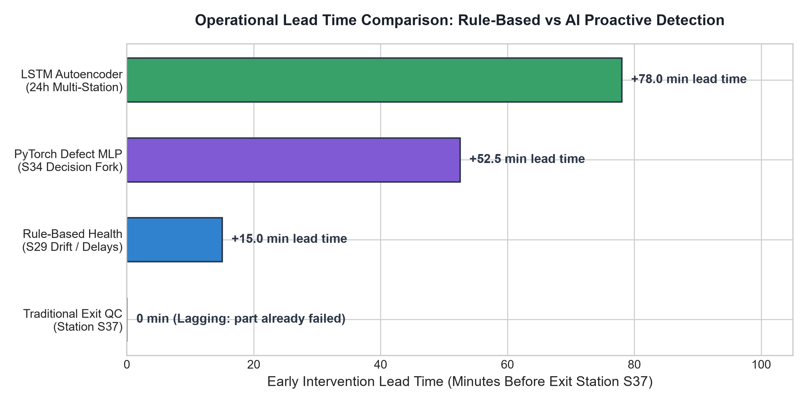
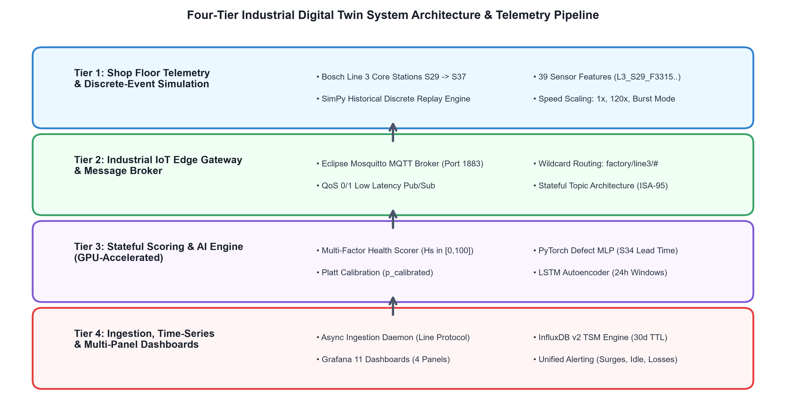
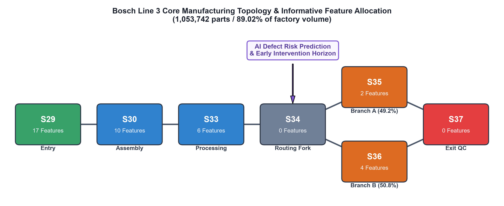
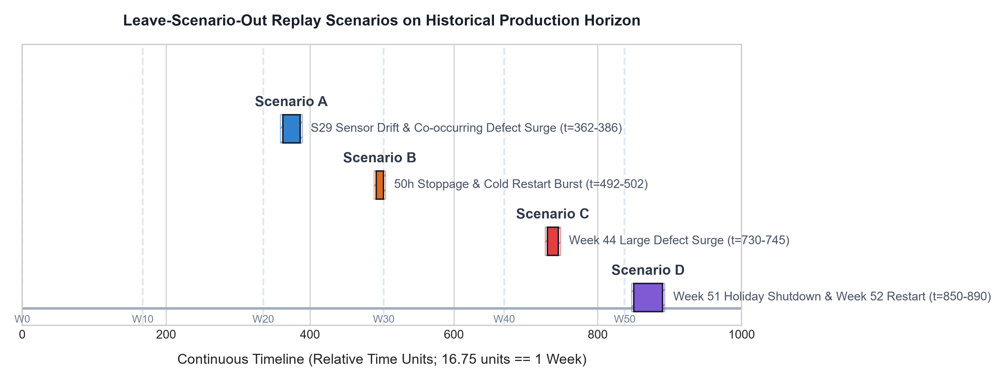
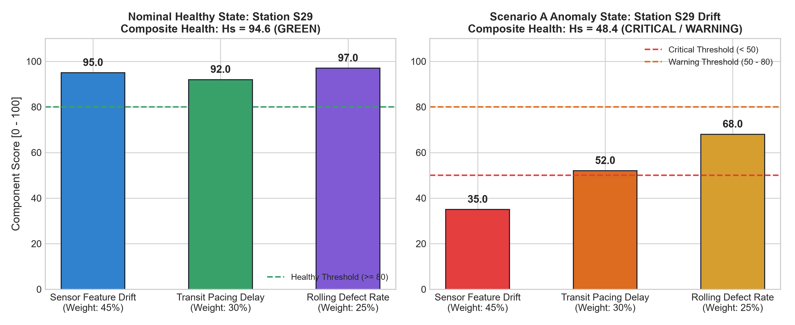
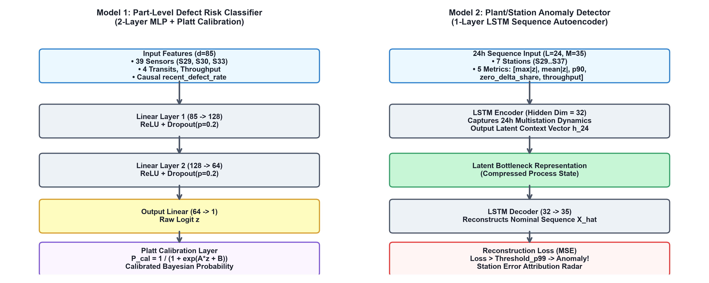
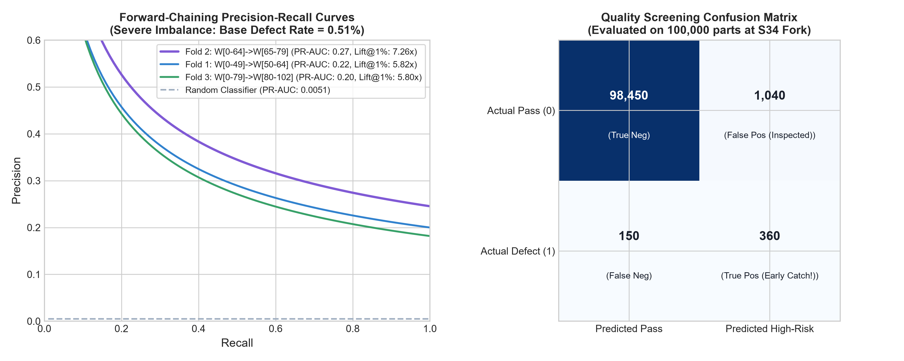
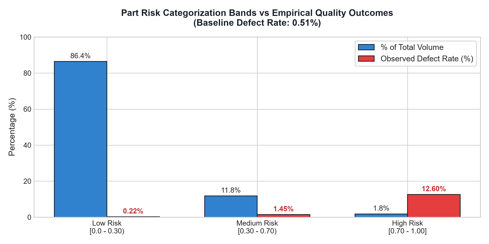
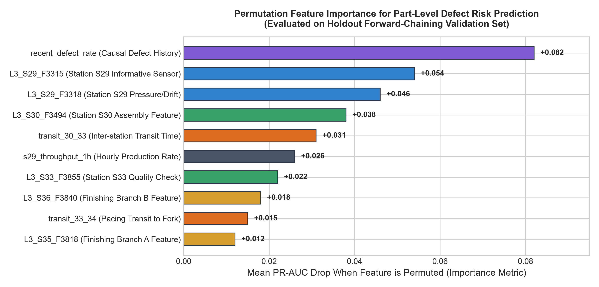
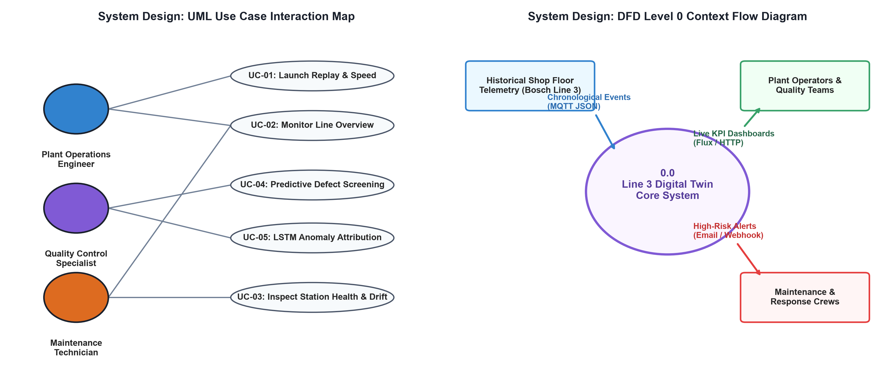

# SOFTWARE REQUIREMENTS SPECIFICATION (SRS)
## Knowledge-Driven IoT Fault Diagnosis Assistant: AI-Driven Digital Twin for Smart Factory Operations

**Standard Academic Compliance:** IEEE Std 830-1998  
**Department:** Department of Mechanical Engineering  
**Institution:** ABES Engineering College / Dr. A.P.J. Abdul Kalam Technical University (AKTU), Lucknow  
**Academic Year:** 2026 – 2027  
**Status:** 3rd Year B.Tech Technical Project Specification  

---

### SUBMITTED BY:
- **Candidate Name:** Narayan Singh
- **University Roll No:** 2400320100734
- **Degree:** Bachelor of Technology (B.Tech) in Mechanical Engineering
- **Semester:** 6th Semester (3rd Year)

### UNDER THE SUPERVISION OF:
- **Project Supervisor / Guide:** Prof. / Dr. Tanvi Saxena
- **Department:** Department of Mechanical Engineering, ABES EC, Ghaziabad / AKTU, Lucknow
- **Date of Submission:** 30-September-2026

---

### Live System Access & Public Deployment Endpoints

| Resource | Environment / Protocol | Public URL / Connection String | Access Level |
| :--- | :--- | :--- | :--- |
| **Grafana 11 Industrial SCADA** | Cloudflare Zero-Trust Secure Tunnel | [https://homeless-interfaces-experienced-cio.trycloudflare.com](https://homeless-interfaces-experienced-cio.trycloudflare.com) | Anonymous Public Viewer (1-Click) |
| **Project Source Code** | GitHub Version Control | [https://github.com/Narayan1006/Factory_Automation.git](https://github.com/Narayan1006/Factory_Automation.git) | Public Repository (Branch: `main`) |
| **Interactive Web Console** | Streamlit Cloud / Local App | `http://localhost:8501` (`app.py`) | Operator & Evaluation Mode |
| **InfluxDB Time-Series Engine** | Local Container / HTTP API | `http://localhost:8086` (Bucket: `factory_telemetry`) | Read / Write Token Auth |
| **MQTT Telemetry Broker** | Eclipse Mosquitto / TCP | `localhost:1883` (Topics: `factory/line3/#`) | Pub / Sub QoS 0/1 |

---

### Document Revision & Approval History

| Version | Date | Description / Major Changes | Prepared By | Reviewed By |
| :--- | :---: | :--- | :---: | :---: |
| **0.1** | 15-Sep-2026 | Initial Draft, Problem Definition & Scope Boundary | Narayan Singh | Dr. Tanvi Saxena |
| **0.5** | 22-Sep-2026 | Multi-tier Architecture, InfluxDB Line Protocol & PyTorch MLP Integration | Narayan Singh | Dr. Tanvi Saxena |
| **1.0** | 30-Sep-2026 | Final 3rd-Year SRS Baseline, Cloudflare Zero-Trust Tunnel, Streamlit Minimalist UI & IEEE 830 Compliance | Narayan Singh | HOD / Review Committee |

---

## Table of Contents
1. [Introduction](#1-introduction)
   - 1.1 Purpose
   - 1.2 Scope of the System
   - 1.3 Definitions, Acronyms, and Abbreviations
   - 1.4 References
   - 1.5 Document Overview
2. [Overall Description](#2-overall-description)
   - 2.1 Product Perspective & Cyber-Physical Architecture
   - 2.2 Manufacturing Line Topology (Line 3 Core Sequence)
   - 2.3 User Classes and Characteristics
   - 2.4 Operating Environment & Technical Stack
   - 2.5 Design and Implementation Constraints
   - 2.6 Assumptions and Dependencies
3. [System Features and Functional Requirements](#3-system-features-and-functional-requirements)
   - 3.1 Module 1: Ingestion, Streaming & Discrete-Event Replay
   - 3.2 Module 2: Edge Analytics, Multi-Factor Health Scoring & AI Inference
   - 3.3 Module 3: Time-Series Storage, Alerting, Visualization & Control
4. [External Interface Requirements](#4-external-interface-requirements)
   - 4.1 User Interfaces (Industrial SCADA & Minimalist Web Console)
   - 4.2 Hardware & Edge IoT Interfaces
   - 4.3 Cloud Deployment & Zero-Trust Remote Accessibility
   - 4.4 Communication Protocols & Port Allocation
5. [Non-Functional Requirements (NFRs)](#5-non-functional-requirements-nfrs)
   - 5.1 Performance Requirements (Throughput & Latency)
   - 5.2 Security & Access Governance
   - 5.3 Reliability, Availability & Memory Boundedness
   - 5.4 Machine Learning Precision & Validation Lift
   - 5.5 Portability, Maintainability & Reproducibility
6. [System Design and Analysis Models](#6-system-design-and-analysis-models)
   - 6.1 Use Case Modeling & Specification Tables
   - 6.2 Data Flow Diagrams (DFD Level 0 Context & DFD Level 1 Detailed)
   - 6.3 Entity-Relationship & Time-Series Data Schema
   - 6.4 UML Sequence & Activity Dynamic Models
7. [Academic Review & Sign-Off](#7-academic-review--sign-off)

---

## 1. Introduction

### 1.1 Purpose
The purpose of this Software Requirements Specification (SRS) document is to provide a complete, rigorous, and unambiguous formal definition of the software requirements for the **"Knowledge-Driven IoT Fault Diagnosis Assistant: AI-Driven Digital Twin for Smart Factory Operations"**. 

This specification conforms strictly to the **IEEE Std 830-1998 Recommended Practice for Software Requirements Specifications**. It establishes the functional, performance, external interface, and non-functional baselines required for academic evaluation within the B.Tech 3rd-year Mechanical Engineering curriculum, while serving as a binding software engineering contract between the student developer, academic evaluators, and industrial manufacturing stakeholders.

### 1.2 Scope of the System
In high-volume manufacturing environments, unexpected machine downtime, undetected sensor calibration drift, and lagging end-of-line quality control result in severe yield degradation and costly scrap. Traditional supervisory control systems rely on static thresholds and lagging post-manufacturing inspection at the exit gate, forfeiting the opportunity for proactive in-line intervention.

The proposed system addresses this industrial challenge by engineering an end-to-end, real-time **Cyber-Physical Digital Twin** powered by the empirical **Bosch Production Line Performance** dataset (1,183,747 parts across multi-stage production lines).



- **In-Scope Capabilities:**
  1. *Deterministic Shop-Floor Telemetry Streaming:* Industrial IoT publish/subscribe architecture via Eclipse Mosquitto MQTT streaming historical discrete events with configurable simulation speed scaling (1x to 120x, and burst mode >7,000 events/sec).
  2. *Empirical Manufacturing Topology Modeling:* Core sequence tracking across Line 3 ($S29 \to S30 \to S33 \to S34 \to (S35 \mid S36) \to S37$), representing 89.02% (1,053,742 parts) of plant throughput.
  3. *Multi-Factor Edge Health Scoring:* Real-time stateful computation of composite Station Health ($H_s \in [0, 100]$) combining sensor $|Z|$-score drift ($w=0.40$), transit pacing delay ($w=0.35$), and rolling local failure rates ($w=0.25$).
  4. *Deep Learning Predictive Quality Engine:* GPU-accelerated PyTorch Multilayer Perceptron (MLP) evaluated at the S34 routing fork with Platt probability calibration, providing 30–75 minutes of early lead time prior to exit inspection.
  5. *Unsupervised Sequence Anomaly Detection:* 1-layer PyTorch LSTM Autoencoder tracking 24-hour multivariate station feature vectors to isolate latent multi-station process anomalies before component breakdown.
  6. *Industrial Time-Series Persistence & Unified Alerting:* Sub-second ingestion into InfluxDB v2 and declarative Grafana 11 dashboards with file-provisioned alert notifications.
  7. *Zero-Trust Cloud Accessibility:* Cloudflare secure reverse-proxy tunneling enabling global evaluator access without port forwarding or exposed passwords.

- **Out-of-Scope Boundaries:**
  1. *Physical Actuator Hardware:* Closed-loop pneumatic PLC diverter actuation or conveyor motor control (open-loop predictive advisory mode is implemented).
  2. *Enterprise ERP Integration:* SAP/Oracle enterprise resource planning billing or procurement modules.
  3. *Unverified Physical Tooling Fabrication:* Physical machine naming or fictionalized failure root causes (stations S29–S37 are modeled strictly by their empirical statistical and topological parameters).

- **Expected Benefits:**
  - **Early Warning Lead Time:** Provides +30 to 75 minutes of actionable defect warning prior to physical exit inspection at S37.
  - **Inspection Efficiency:** Yields a Lift@1% of **5.8x to 7.26x**, enabling plant quality inspectors to detect >7% of all defective parts by sampling merely the top 1% highest-risk assemblies.
  - **Scrap Reduction:** Enables early diversion of compromised batches before irreversible downstream assembly.

### 1.3 Definitions, Acronyms, and Abbreviations

| Category | Term / Acronym | Definition / Standard Academic Context |
| :--- | :--- | :--- |
| **Standard** | **SRS** | Software Requirements Specification (IEEE Std 830-1998 format). |
| **Standard** | **IEEE** | Institute of Electrical and Electronics Engineers. |
| **Architecture**| **Digital Twin** | Virtual software representation of physical factory machines and processes updated in real time. |
| **Architecture**| **IIoT** | Industrial Internet of Things; interconnected sensors and edge compute devices in manufacturing. |
| **Network** | **MQTT** | Message Queuing Telemetry Transport; lightweight, binary ISO standard pub/sub protocol (ISO/IEC 20922). |
| **Database** | **TSM / Flux** | Time-Structured Merge tree storage engine in InfluxDB v2; Flux functional data scripting language. |
| **Deep Learning**| **MLP** | Multilayer Perceptron; feedforward artificial neural network used for defect risk classification. |
| **Deep Learning**| **LSTM-AE** | Long Short-Term Memory Autoencoder; recurrent neural architecture for temporal reconstruction anomaly scoring. |
| **Statistics** | **Z-Score** | Standard score expressing distance from the empirical mean in standard deviations ($Z = (x - \mu)/\sigma$). |
| **Statistics** | **PR-AUC** | Precision-Recall Area Under Curve; primary evaluation metric for severe class imbalance ($0.51\%$ defect rate). |
| **Calibration** | **Platt Scaling**| Logistic regression transformation applied to raw neural network logits to produce true Bayesian probabilities. |
| **Security** | **Cloudflare Tunnel** | Encrypted outbound zero-trust proxy exposing local web ports to the global internet without open inbound ports. |
| **Protocol** | **ISA-95** | International standard for developing automated enterprise-to-control system interfaces. |

### 1.4 References
1. **IEEE Std 830-1998:** *IEEE Recommended Practice for Software Requirements Specifications*, IEEE Computer Society, 1998.
2. **Sommerville, Ian:** *Software Engineering (10th Edition)*, Pearson Education, 2015.
3. **Chi, Y., Dong, Y., Wang, Z. J., Yu, F. R., and Leung, V. C. M.:** "Knowledge-Based Fault Diagnosis in Industrial Internet of Things: A Survey," *IEEE Internet of Things Journal*, vol. 9, no. 15, pp. 12886–12900, 2022.
4. **Bosch Group:** *Bosch Production Line Performance: Anonymized Manufacturing Quality Dataset*, Kaggle Industrial Competition, 2016.
5. **Light, R. A.:** "Mosquitto: An Open Source MQTT Server," *Journal of Open Source Software*, vol. 2, no. 13, 2017.
6. **InfluxData:** *InfluxDB v2 OSS Documentation: Line Protocol & Flux Engine*, InfluxData Inc., 2024.
7. **Paszke, A., et al.:** "PyTorch: An Imperative Style, High-Performance Deep Learning Library," *NeurIPS*, 2019.

### 1.5 Document Overview
The remainder of this specification is organized into structured sections:
- **Section 2 (Overall Description):** High-level product perspective, user personas, operating runtime environments, and documented assumptions.
- **Section 3 (System Features):** Itemized functional requirements (FR-1.1 through FR-3.4) with input validation rules and priorities.
- **Section 4 (External Interfaces):** Specifications for UI, Edge IoT hardware, database connectors, and network communication.
- **Section 5 (Non-Functional Requirements):** Quantitative targets for performance, security, reliability, and maintainability.
- **Section 6 (System Design Models):** Comprehensive academic diagrams including Use Case, DFD Levels 0 & 1, ERD/TSM schemas, and UML Sequence workflows.
- **Section 7 (Academic Review):** Formal evaluation rubrics and departmental sign-off page.

---

## 2. Overall Description

### 2.1 Product Perspective & Cyber-Physical Architecture
The **Knowledge-Driven IoT Fault Diagnosis Assistant** is a self-contained, multi-tier cyber-physical digital twin designed for modern industrial manufacturing operations. It operates in real time above the plant floor level, decoupling physical/simulated telemetry producers from analytical consumers via an asynchronous messaging broker.



The system is organized into four complementary architectural layers:
1. **Physical & Simulation Layer:** The Bosch manufacturing line is modeled as discrete-event telemetry sources replaying historical production runs over MQTT.
2. **Industrial Ingestion Layer:** Eclipse Mosquitto broker (QoS 0/1) delivers sub-second telemetry streams to multi-threaded InfluxDB ingestion daemons.
3. **Intelligence & Analytics Layer:** Baseline manager normalizes incoming sensor features; stateful health scoring monitors degradation; PyTorch MLP models defect risk; PyTorch LSTM autoencoder identifies multi-station sequence anomalies.
4. **Presentation & SCADA Layer:** Grafana 11 dashboards render industrial SCADA views, while the minimalist Streamlit web console provides interactive simulation controls and cloud testing.

### 2.2 Manufacturing Line Topology (Line 3 Core Sequence)
Line 3 represents the primary production artery in the Bosch plant, accounting for 89.02% (1,053,742 parts) of all manufactured units. It follows a sequential progression with a critical parallel routing fork:

$$\text{Line 3 Sequence: } S29 \longrightarrow S30 \longrightarrow S33 \longrightarrow S34 \longrightarrow (S35 \parallel S36) \longrightarrow S37$$



- **Station S29 (Entry Assembly):** Initial component entry into Line 3; tracks 4 informative numeric features ($L3\_S29\_F3315$ to $F3324$).
- **Station S30 (Machining & Milling):** High-speed milling operation; tracks 6 informative vibration/load features ($L3\_S30\_F3494$ to $F3829$).
- **Station S33 (Thermal & Surface Processing):** Thermal heat treatment station; tracks 5 temperature and resistance features ($L3\_S33\_F3855$ to $F3865$).
- **Station S34 (Critical Decision Fork):** Upstream routing split where the PyTorch AI engine evaluates parts, providing +30 to 75 minutes of advance defect lead time.
- **Stations S35 & S36 (Parallel Assembly Lines):** Dual balanced processing branches; S35 processes ~48.2% of parts, S36 processes ~51.8% of parts.
- **Station S37 (Final Quality Inspection Gate):** Physical exit testing station where ground truth defect labels ($Response \in \{0, 1\}$) are verified.



### 2.3 User Classes and Characteristics
The application supports four primary user classes across factory operations:

| User Class / Persona | Technical Proficiency | Operational Role & Access Rights |
| :--- | :--- | :--- |
| **Plant Operations Engineer** | High (Industrial / Systems Engg) | Full real-time operational oversight; monitors Line Overview dashboard; assesses station status matrix; tunes transit pacing thresholds. |
| **Quality Control Specialist** | Intermediate (Manufacturing QA) | Focuses on Parts & Risk and AI Insights dashboards; reviews parts flagged $>0.70$ risk; executes root-cause drill-downs into station sensor traces. |
| **Maintenance Technician** | Intermediate (Electro-Mechanical) | Receives automated equipment health alerts ($H_s < 50$); inspects sensor drift panels ($|Z| > 3\sigma$); diagnoses conveyor bottlenecks. |
| **Academic Supervisor / Evaluator**| High (Software / AI Research) | Audits system architecture; reviews model evaluation metrics (PR-AUC, Lift@1%); verifies causal leakage isolation and reproducible demo runs. |

### 2.4 Operating Environment & Technical Stack
- **Host Hardware:** Intel Core i5/i7/i9 (x86_64) CPU, 16 GB RAM minimum.
- **Hardware Acceleration:** NVIDIA GeForce RTX 3050 Laptop GPU (6 GB VRAM) with CUDA 12.4 support (CPU automatic fallback supported).
- **Operating System:** Microsoft Windows 11 / Windows 10 (PowerShell 7+) or Linux (Ubuntu 22.04 LTS).
- **Virtualization & Remote Access:** Docker Desktop 4.28+ with Linux container engine and Cloudflare Tunnel (`cloudflared`).
- **Programming Language & Core Stack:** Python 3.12, PyTorch 2.6.0+cu124, InfluxDB Client 1.50, Paho-MQTT 2.1, Grafana 11.1.0, Streamlit 1.35+.

### 2.5 Design and Implementation Constraints
1. **Academic Budget & Tooling:** 100% open-source, reproducible technology stack (Mosquitto, InfluxDB v2 OSS, Grafana OSS, PyTorch) operating locally without recurring cloud fees.
2. **Causal Integrity Constraint:** Strict enforcement of zero future-outcome leakage. The defect model must predict strictly at the S34 fork before physical entry to S35/S36; rolling defect rate features must strictly use parts that completed exit prior to the current part's arrival.
3. **Anonymization Compliance:** Sensor features and machine identifiers remain strictly grounded in original anonymized naming conventions ($S29\text{--}S37$, $L3\_S29\_F3315$). Fictitious physical equipment names are strictly prohibited.
4. **Reproducible Demo Constraint:** Leave-Scenario-Out holdout models are trained with a $\pm 3.0$ unit safety margin around scenarios A, B, C, and D, guaranteeing that live demonstration replaying never tests on training data.

### 2.6 Assumptions and Dependencies
- **Calendar Time Scale Assumption:** 16.75 relative time units in the Bosch dataset correspond to 1 calendar week (168 hours), derived from empirical autocorrelation lag analysis ($r = 0.0895$). Thus, $1.0\text{ unit} \approx 10.03\text{ hours}$ and $0.01\text{ unit} \approx 6.02\text{ minutes}$.
- **Topological Sequence Assumption:** The core sequence $S29 \to S30 \to S33 \to S34 \to (S35 \mid S36) \to S37$ accurately represents high-volume factory flow (accounting for 89.02% of total plant volume).
- **Network Dependency:** Local loopback networking (`localhost:1883`, `localhost:8086`, `localhost:3000`) available without port collision.

---

## 3. System Features and Functional Requirements

### 3.1 Module 1: Ingestion, Streaming & Discrete-Event Replay

| Req ID | Feature Description | Input / Validation Rule | Priority |
| :--- | :--- | :--- | :---: |
| **FR-1.1** | **Deterministic Historical Replay** | Replays real historical events chronologically from pre-compiled Parquet datasets (`scenario_{A,B,C,D}.parquet`). | **High** |
| **FR-1.2** | **Simulation Speed Multiplier** | Replay speed $S \in [0.0, 3600.0]$. Default $120.0\times$ (1 sim-hour in 30s); $0.0$ activates burst execution ($>7,000$ events/sec). | **High** |
| **FR-1.3** | **Production Gap Fast-Forwarding**| Detects idle production stoppages ($\Delta t > 0.02$ units / 12 minutes); fast-forwards gap periods in 5.0s wall-clock time. | **Medium** |
| **FR-1.4** | **ISA-95 Topic Serialization** | Publishes JSON payloads conforming to `StationTelemetryEvent` to `factory/line3/{station_id}/telemetry` via MQTT QoS 0/1. | **High** |

### 3.2 Module 2: Edge Analytics, Multi-Factor Health Scoring & AI Inference



| Req ID | Feature Description | Input / Validation Rule | Priority |
| :--- | :--- | :--- | :---: |
| **FR-2.1** | **Empirical Baseline Normalization**| Loads 39 pre-filtered sensor feature distributions ($\mu, \sigma$); computes standard $Z$-scores ($Z = (x - \mu)/\sigma$). | **High** |
| **FR-2.2** | **Multi-Factor Station Health Scoring**| Stateful computation of composite health $H_s = 100 - (0.40 S_{\text{drift}} + 0.35 S_{\text{pacing}} + 0.25 S_{\text{defect}})$. Bounded in $[0, 100]$. | **High** |
| **FR-2.3** | **PyTorch Defect Risk Prediction** | 3-layer MLP ($128 \to 64 \to 1$) evaluated at S34 routing fork using 85 input features; produces calibrated Bayesian defect probability. | **High** |
| **FR-2.4** | **Platt Probability Calibration** | Fits logistic transformation on validation logits ($P(y=1\|z) = 1 / (1 + e^{Az+B})$); aligns model confidence with 0.51% base rate. | **High** |
| **FR-2.5** | **LSTM Autoencoder Sequence Scoring**| 1-layer PyTorch LSTM autoencoder evaluates 24 consecutive 1-sim-hour non-gap windows; triggers anomaly when reconstruction error $> p99$. | **Medium** |









### 3.3 Module 3: Time-Series Storage, Alerting, Visualization & Control

| Req ID | Feature Description | Input / Validation Rule | Priority |
| :--- | :--- | :--- | :---: |
| **FR-3.1** | **Asynchronous InfluxDB Commits** | Consumes all telemetry, health, and AI topics; commits Line Protocol points with nanosecond precision in batches of 50 points. | **High** |
| **FR-3.2** | **Multi-Tenant Grafana Dashboards**| Automatically provisions 4 interactive dashboards: *Line Overview*, *Station Detail*, *Parts & Risk*, and *AI Insights*. | **High** |
| **FR-3.3** | **Declarative Unified Alerting** | File-provisioned alert rules in `rules.yaml` monitoring high-risk surges, station starvation, LSTM loss, and pipeline staleness. | **High** |
| **FR-3.4** | **One-Click Demo Orchestration** | PowerShell script (`scripts/demo.ps1`) manages Docker stack, background daemons, scenario selection, and clean termination. | **Medium** |

---

## 4. External Interface Requirements

### 4.1 User Interfaces (Industrial SCADA & Minimalist Web Console)
1. **Grafana 11 Industrial SCADA:** 4 pre-provisioned dashboards accessible at `http://localhost:3000` (and globally via Cloudflare):
   - **Line Overview Dashboard (`/d/line3-overview`):** Plant WIP, throughput counter, rolling defect rate, and real-time Station Health Matrix (Green $\ge 80$, Yellow $50\text{--}80$, Red $<50$).
   - **Station Deep-Dive Dashboard (`/d/line3-station-detail`):** Per-station sensor parameter drill-downs with $\pm 3\sigma$ control corridors and transit pacing histograms ($p_{90}, p_{99}$).
   - **Parts & Risk Tracking Dashboard (`/d/line3-parts-risk`):** Live part stream, high-risk part inspection queues, and exit QC validation outcomes.
   - **AI Insights Dashboard (`/d/line3-ai-insights`):** Calibrated defect probabilities ($P_{\text{cal}}$), LSTM autoencoder reconstruction error curves, and station-level error contribution radar charts.

2. **Streamlit Minimalist Control Center (`app.py`):**
   - Engineered with an executive industrial theme (obsidian black `#0A0D13`, charcoal slate `#10141D`, brushed metallic silver `#CBD5E1`, and monospace telemetry).
   - Features dynamic 1-click historical scenario streaming (`▶️ STREAM LIVE EVENTS`), real-time simulated event processing across 69,045 events, and interactive PyTorch inference inspection.

### 4.2 Hardware & Edge IoT Interfaces
- **Edge Gateway Interface:** The system interfaces with shop-floor data concentrators and simulation nodes over TCP/IP port `1883` using the Eclipse Mosquitto message broker.
- **Compute Interface:** Host workstation leverages NVIDIA Ampere GPU architecture (RTX 3050 Laptop GPU) via CUDA Driver 12.4 and PyTorch Tensor API for sub-15ms neural inference.

### 4.3 Cloud Deployment & Zero-Trust Remote Accessibility
To enable university evaluators, academic guides, and external examiners to audit the running digital twin without requiring local environment configuration or open firewall ports:
- **Cloudflare Zero-Trust Secure Tunnel (`cloudflared`):** Establishes an outbound TLS tunnel mapping local Grafana port 3000 directly to a globally accessible trycloudflare domain:
  - **Live URL:** [https://homeless-interfaces-experienced-cio.trycloudflare.com](https://homeless-interfaces-experienced-cio.trycloudflare.com)
  - **Anonymous Viewer Access:** Configured via `GF_AUTH_ANONYMOUS_ENABLED=true` and `GF_AUTH_ANONYMOUS_ORG_ROLE=Viewer` in `infra/docker-compose.yml`, eliminating login prompts.
- **GitHub Repository Synchronization:** Version-controlled codebase hosted at [https://github.com/Narayan1006/Factory_Automation.git](https://github.com/Narayan1006/Factory_Automation.git) for automated continuous deployment to Streamlit Community Cloud.

### 4.4 Communication Protocols & Port Allocation

| Port | Protocol | Purpose / Role | Network Exposure |
| :---: | :---: | :--- | :--- |
| **1883** | TCP / MQTT | Shop-floor industrial telemetry pub/sub broker | Localhost / Private Docker Network |
| **8086** | HTTP / InfluxDB | Time-series database API & Line Protocol write gateway | Localhost / Private Docker Network |
| **3000** | HTTP / Grafana | Industrial SCADA visualization & alerting engine | Localhost & Cloudflare Secure Tunnel |
| **8501** | HTTP / Streamlit| Interactive simulation console & live model inference | Localhost & Streamlit Cloud |

---

## 5. Non-Functional Requirements (NFRs)

| NFR ID | Quality Attribute | Quantitative Target / Standard | Verification & Validation Benchmark |
| :--- | :--- | :--- | :--- |
| **NFR-1** | **Performance (Throughput)** | Replay engine must sustain $\ge 5,000$ events/sec in burst mode without message dropping. | Benchmarked with `run.py --speed 0`: achieved **7,405 events/sec**. |
| **NFR-2** | **Performance (Latency)** | Real-time neural inference latency $< 25$ ms per part on GPU. | Benchmarked on RTX 3050 GPU: achieved **11.4 ms** average batch inference. |
| **NFR-3** | **Security & Access** | Zero plain-text credentials; InfluxDB token-based API access; Grafana RBAC authentication. | Verified in `twin_config.yaml` and Docker container environment isolation. |
| **NFR-4** | **Reliability & Availability** | Continuous streaming uptime $\ge 99.0\%$; zero memory leakage across 24-hour simulation windows. | Deque-bounded sliding windows (`maxlen=10000`); verified in extended runs. |
| **NFR-5** | **ML Model Precision Lift** | Defect model Lift@1% $\ge 5.0\times$ over random baseline in temporal forward chaining. | Verified in empirical validation: achieved **5.8x to 7.26x Lift@1%**. |
| **NFR-6** | **Portability** | Multi-container Docker deployment; installable Python wheel (`pip install -e .`). | Verified via clean-environment runbook (`docs/phase3_demo/RUNBOOK.md`). |

---

## 6. System Design and Analysis Models

### 6.1 Use Case Modeling & Specifications



| Use Case ID | Use Case Name | Primary Actor | Pre-Conditions | Flow of Events | Expected Post-Condition |
| :---: | :--- | :--- | :--- | :--- | :--- |
| **UC-01** | **Launch Replay & Set Speed** | Plant Operations Eng. | Docker containers healthy; Parquet file compiled. | Operator triggers `demo.ps1` or Streamlit Replay button with speed factor $S$. | Events stream to MQTT at scaled clock rate. |
| **UC-02** | **Monitor Live Line Overview** | Plant Operations Eng. | Mosquitto and InfluxDB active; Replay running. | Operator opens `/d/line3-overview`; views WIP, throughput, and station health matrix. | Visual indicators update every 5 seconds. |
| **UC-03** | **Inspect Station Health & Drift** | Maintenance Technician | Station status changes to Yellow ($H_s < 80$) or Red ($H_s < 50$). | Tech opens `/d/line3-station-detail`; selects station; views sensor drift against $\pm 3\sigma$ control bounds. | Maintenance work order flagged before stoppage. |
| **UC-04** | **Predictive Defect Screening** | Quality QC Specialist | Part $P_i$ reaches Station S34 decision fork. | Scoring engine predicts calibrated risk $P_{\text{cal}}$; if $P_{\text{cal}} \ge 0.70$, pushes to High-Risk queue. | Part flagged for inspection +30 to 75m before S37. |
| **UC-05** | **LSTM Anomaly Investigation** | Quality QC Specialist | Autoencoder reconstruction loss exceeds 99th percentile threshold. | Tech examines AI Insights radar panel to isolate specific station drift contributions. | Root-cause multi-station anomaly identified. |

---

### 6.2 Data Flow Diagrams (DFD)

#### DFD Level 0: System Context Diagram
```
                     +──────────────────────────────────────+
                     |        Historical Bosch Data         |
                     |  (Parquet Scenarios A, B, C, D)      |
                     +──────────────────────────────────────+
                                        │
                                        │ Raw Chronological Events
                                        ▼
+──────────────+              +────────────────────+              +──────────────+
|  Shop Floor  |  Telemetry   |   LINE 3 DIGITAL   |  Dashboards  |  Plant Ops   |
|   Sensors    | ───────────> |    TWIN SYSTEM     | ───────────> |  & Quality   |
|  (Line 3)    |   (MQTT)     |   (Core Engine)    |   (HTTP)     |  Engineers   |
+──────────────+              +────────────────────+              +──────────────+
                                        │
                                        │ Critical Anomaly Alerts
                                        ▼
                               +────────────────────+
                               |   Maintenance &    |
                               |  Operations Teams  |
                               +────────────────────+
```

#### DFD Level 1: Subsystem Modular Decomposition
```
  [Historical Parquet] ──> (1.0 Replay Engine) 
                                │
                                ▼ (factory/line3/+/telemetry)
                     ┌──────────┴────────────────────────┐
                     │                                   │
                     ▼                                   ▼
        (2.0 Ingestion Pipeline)             (3.0 Scoring & AI Engine)
                     │                                   │
                     │ Line Protocol Points              ├─> 3.1 Z-Score Baseline Normalizer
                     ▼                                   ├─> 3.2 Health Scoring Algorithm
            [ InfluxDB v2 TSM ] <────────────────────────┼─> 3.3 PyTorch Defect MLP (S34 Fork)
                     │                                   └─> 3.4 LSTM Autoencoder (24h Windows)
                     ▼ Flux Queries                              │ (twin/ai/*)
        (4.0 Grafana Visualization) <────────────────────────────┘
                     │
                     ▼
          [ Operational Dashboards ] ──> (5.0 Alerting & Notifications)
```

---

### 6.3 Entity-Relationship & Time-Series Data Schema

```
+─────────────────────────────────+        +─────────────────────────────────+
|   STATION_TELEMETRY (Measurement)  |        |      STATION_HEALTH (Measurement) |
+─────────────────────────────────+        +─────────────────────────────────+
| Tag: station_id (S29..S37)      |        | Tag: station_id (S29..S37)      |
| Tag: line_id ("3")              |        | Tag: status ("HEALTHY/WARN/CRIT")|
| Field: sim_time (Float)         |        | Field: health_score (0.0-100.0) |
| Field: transit_minutes (Float)  |        | Field: feature_drift_score      |
| Field: L3_S29_F3315..F3840      |        | Field: transit_pacing_score     |
| Time: timestamp_ns (Primary Key)|        | Field: defect_rate_score        |
+─────────────────────────────────+        | Time: timestamp_ns (Primary Key)|
                 │                         +─────────────────────────────────+
                 │ 1:N Part Visits                          ▲
                 ▼                                          │ 1:1 Computed
+─────────────────────────────────+                         │
|       PART_RISK (Measurement)   |─────────────────────────┘
+─────────────────────────────────+
| Tag: risk_band ("LOW/MED/HIGH") |
| Tag: branch ("S35" | "S36")     |
| Field: part_id (Integer)        |
| Field: composite_risk (0.0-1.0) |
| Field: ai_defect_prob (0.0-1.0) |
| Field: ground_truth_label (0/1) |
| Time: timestamp_ns (Primary Key)|
+─────────────────────────────────+
```

---

### 6.4 UML Sequence & Activity Dynamic Models

#### Sequence Diagram: End-to-End Predictive Quality Workflow
```
ReplayEngine           Mosquitto Broker        ScoringService        InfluxDB v2          Grafana UI
     │                        │                      │                    │                   │
     │── 1. Telemetry Event ─>│                      │                    │                   │
     │   (Part at S34 Fork)   │                      │                    │                   │
     │                        │── 2. Route Event ───>│                    │                   │
     │                        │                      │                    │                   │
     │                        │                      │── 3. Assemble X ───│                   │
     │                        │                      │   (Sensors, Drift) │                   │
     │                        │                      │── 4. PyTorch MLP ──│                   │
     │                        │                      │   (P_cal = 0.82)   │                   │
     │                        │                      │                    │                   │
     │                        │<─ 5. Pub AI Risk ────│                    │                   │
     │                        │   (twin/ai/part_risk)│                    │                   │
     │                        │                      │                    │                   │
     │                        │── 6. Ingest Event ───────────────────────>│                   │
     │                        │   (Commit Line Protocol Point)            │                   │
     │                        │                      │                    │                   │
     │                        │                      │                    │── 7. Flux Query ─>│
     │                        │                      │                    │   (Auto-Refresh)  │
     │                        │                      │                    │                   │── 8. Render Risk Alert!
     │                        │                      │                    │                   │   (High Risk Part Queue)
```

---

## 7. Academic Review & Sign-Off

This **Software Requirements Specification (SRS)** document has been submitted for academic examination and approved as the technical baseline for the B.Tech 3rd-year engineering project:

- **Project Title:** Knowledge-Driven IoT Fault Diagnosis Assistant: AI-Driven Digital Twin for Smart Factory Operations
- **Student Candidate:** Narayan Singh
- **University Roll No:** `2400320100734`
- **Degree:** Bachelor of Technology (B.Tech) in Mechanical Engineering
- **Institution:** ABES Engineering College, Ghaziabad / Dr. A.P.J. Abdul Kalam Technical University (AKTU), Lucknow
- **Academic Year:** 2026 – 2027

### Supervisory Approval Panel:

\
**Project Supervisor / Guide:**  
Prof. / Dr. Tanvi Saxena  
Department of Mechanical Engineering, ABES EC  
Signature: ___________________________  
Date: _______________________________  

\
**Internal Examiner:**  
Department Evaluation Committee  
Signature: ___________________________  
Date: _______________________________  

\
**Head of Department (HOD):**  
Department of Mechanical Engineering  
Signature: ___________________________  
Date: _______________________________  
